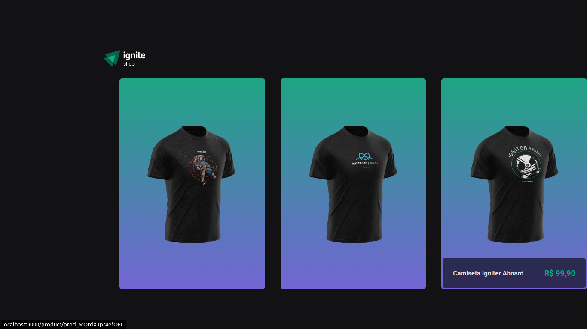
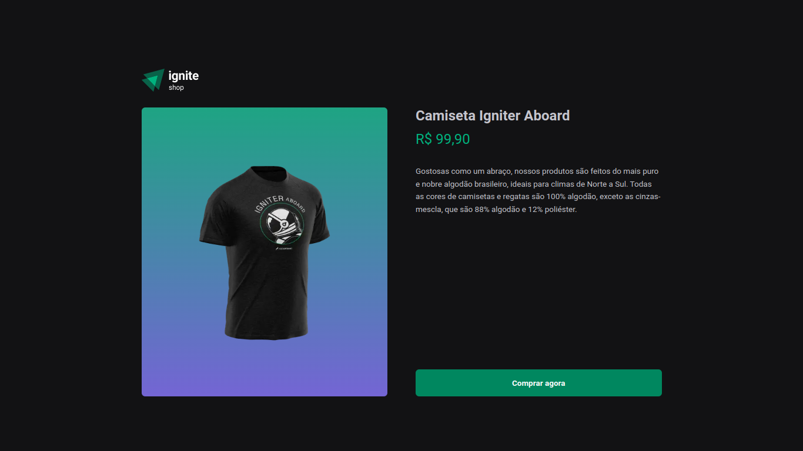
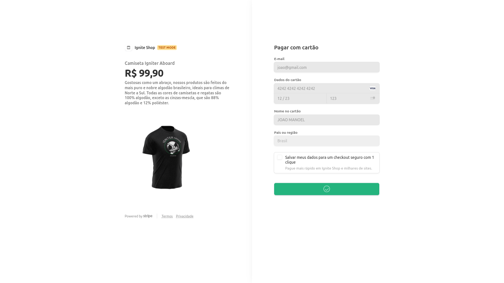
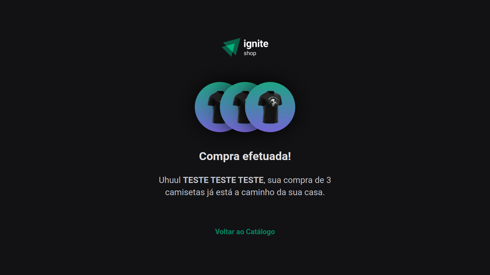

# ignite-shop

Projeto realizado para solidificar conceitos do NextJS.

### 🎨 Layout Web

<div align="center">
  <h2 align="center" >Home</h2>
    
  <h2 align="center" >Product</h2>
    
  <h2 align="center" >Buy</h2>
    
  <h2 align="center" >Success</h2>
    
</div>

### Pré-requisitos

Antes de começar, você vai precisar ter instalado em sua máquina as seguintes ferramentas:
[Git](https://git-scm.com), [Node.js](https://nodejs.org/en/), [yarn](https://yarnpkg.com/). 
Além disto é recomendado ter um editor para trabalhar com o código como [VSCode](https://code.visualstudio.com/).

#### 🎲 Rodando o app

```bash
# Clone este repositório
$ git clone git@github.com:JoaoManoelDev/ignite-shop.git
# Acesse a pasta do projeto no terminal/cmd
$ cd ignite-shop
# Instale as dependências
$ yarn add
# Execute a aplicação em modo de desenvolvimento
$ yarn dev
# O servidor inciará na porta:3000 - acesse http://localhost:3000
```

Feito com ❤️ por João Manoel
